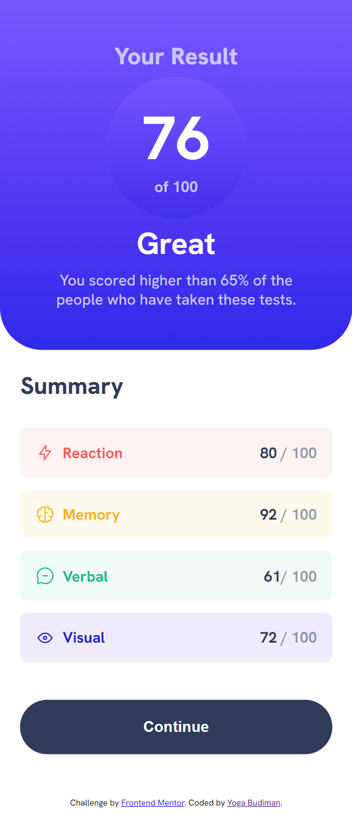

# Frontend Mentor - Results summary component solution

This is a solution to the [Results summary component challenge on Frontend Mentor](https://www.frontendmentor.io/challenges/results-summary-component-CE_K6s0maV). Frontend Mentor challenges help you improve your coding skills by building realistic projects.

## Table of contents

- [Overview](#overview)
  - [The challenge](#the-challenge)
  - [Screenshot](#screenshot)
  - [Links](#links)
- [My process](#my-process)
  - [Built with](#built-with)
  - [What I learned](#what-i-learned)
  - [Continued development](#continued-development)
  - [Useful resources](#useful-resources)
- [Author](#author)

## Overview

### The challenge

Users should be able to:

- View the optimal layout for the interface depending on their device's screen size
- See hover and focus states for all interactive elements on the page
- **Bonus**: Use the local JSON data to dynamically populate the content

### Screenshot

### Links

- Solution URL: (https://github.com/ygabdn29/result-summary-card)
- Live Site URL:

## My process

### Built with

- HTML5
- CSS
- Flexbox
- CSS Grid
- Desktop-first workflow

### What I learned

In this challenge I'm exercising what I've learned about combining flex and grid to create a layout. Also in this challenge I tried to create some rough sketches using pencil and paper to give me general ideas about the layout that I want to create. This process helped me to create a more clear markup, though in my opinion my markup still messy but I hope by continuuing this process will make my markup more organized in the future.

### Continued development

- Fetching data from local json and put the data into summary rather than hard code it.
- Spacing and color scheme used in my solution could be improved in the future.

### Useful resources

- [MDN](https://developer.mozilla.org/en-US/)
- [Stackoverflow](https://stackoverflow.com/)

## Author

- Yoga Budiman
